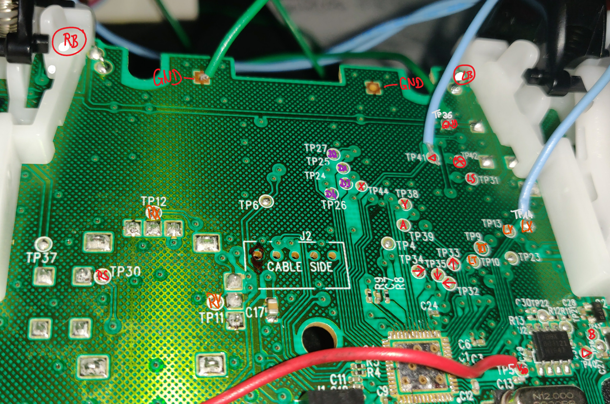
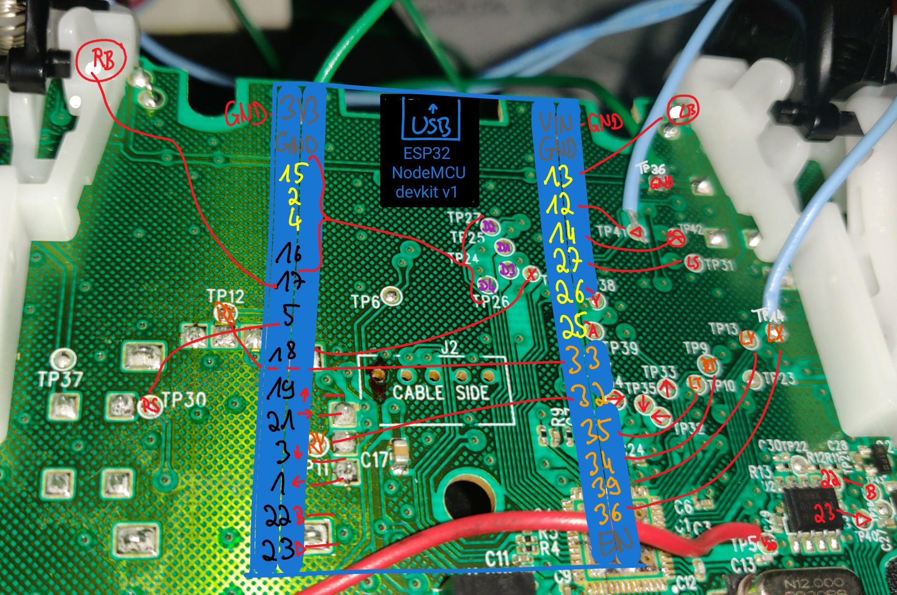
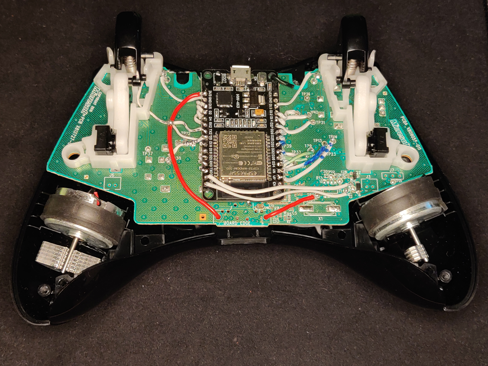
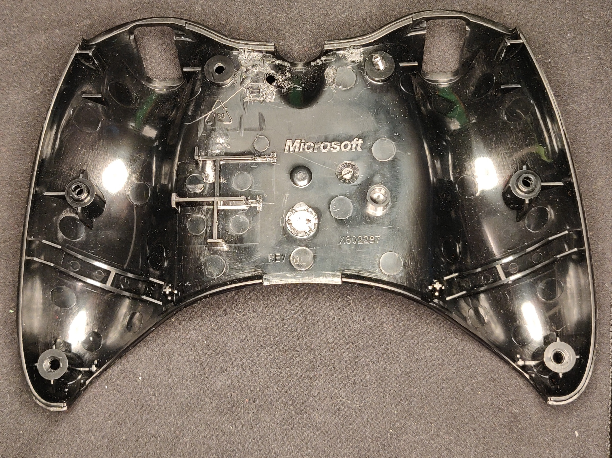

# ESP32 Xbox360-BLE-Controller

This is a project for recycling a dead Xbox360 Controller using an ESP32 devkit v1. The ESP reads the buttons and axes of the Xbox360 Controller

## Onboard Circuit

The first step was to identify where to connect the IO-Pins of the ESP32 to. There are many testpoint-spots on the mainboard of the controller, so first of all we measured which TP connects to which user-input:

RED=digital, ORANGE=analog, PURPLE=LEDs (digital out)

Then we come up with a position to place the ESP on the mainboard, so that it can be connected to all TPs. Conveniently though, it fits perfectly when the USB slot of the ESP is aligned with the cable port of the controller.

Notice how we also removed the BOOT-button from the ESP, which kept triggering as soon we put the back cover on, blocking the ESP from booting. From the mainboard we removed all big parts that we felt were disturbing. Removing the headset port 

## Back cover

Although the ESP does fit quite nicely, the back cover of the controller has to be adapted a little: We drilled a hole at the point where the EN-button (reboot) touches the cover. This way we can still use it from the outside. If you don't think you will need it, you can also remove the button from the ESP - though it can come in handy to have a functioning reset.

